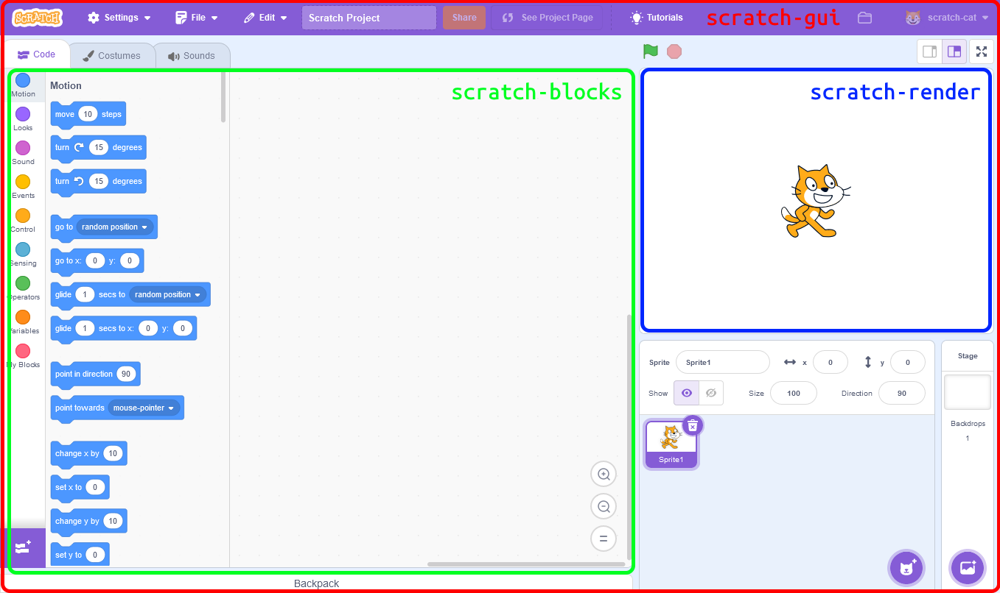

# Structure of Scratch

Unlike the previous versions of Scratch, Scratch 3.0 is separated into multiple packages, each of which is responsible for part of Scratch. For most mods, you probably do not need to modify all the packages.

:::note
The Important badge is used to indicate components that are important _in modding_ Scratch. Most of the components provide important functionality that Scratch would not work without or have a degraded experience without.
:::

## `scratch-editor` Important
Previously, Scratch 3.0 was split into multiple GitHub repositories. Scratch 3.0 is now moving towards having a single repository for the entire Scratch editor. This repository is [`scratch-editor`](https://github.com/scratchfoundation/scratch-editor). Even though it is a single repository, the various components are still in separate packages in the repository, and not all Scratch editor packages have been migrated to this repository yet.

### `scratch-gui` Important
[`scratch-gui`](github.com/scratchfoundation/scratch-editor/tree/develop/packages/scratch-gui) is the _main_ package of Scratch. It brings together all the other packages and contains most of the user interface of Scratch.

### `scratch-vm` Important
[`scratch-vm`](https://github.com/scratchfoundation/scratch-editor/tree/develop/packages/scratch-vm) is responsible for executing the project code. This package contains the code that is executed when a block runs. It also contains the code for the built in extensions.

### `scratch-render`
[`scratch-render`](https://github.com/scratchfoundation/scratch-editor/tree/develop/packages/scratch-render) contains the code responsible for rendering the project stage.

### `scratch-svg-renderer`
[`scratch-svg-renderer`](https://github.com/scratchfoundation/scratch-editor/tree/develop/packages/scratch-svg-renderer) renders SVGs, while maintaining compatibility with Scratch 2.0's SVGs.

## `scratch-blocks` Important
[`scratch-blocks`](https://github.com/scratchfoundation/scratch-blocks) is the actual code editor part of the Scratch editor. It provides the block toolbox, workspace and the visuals of the blocks themselves. scratch-blocks uses [Blockly](https://developers.google.com/blockly/guides/get-started/what-is-blockly) library. Blockly was developed by Google and is now part of the Raspberry Pi Foundation.

## `scratch-paint`
[`scratch-paint`](https://github.com/scratchfoundation/scratch-paint) is the Scratch paint editor.

## `scratch-audio`
[`scratch-audio`](https://github.com/scratchfoundation/scratch-audio) handles playing of audio in the project.

## `scratch-desktop`
[`scratch-desktop`](https://github.com/scratchfoundation/scratch-desktop) is the [Electron](https://electronjs.org)-based desktop application for Scratch.

## `scratch-render-fonts`
[`scratch-render-fonts`](https://github.com/scratchfoundation/scratch-render-fonts) contains the fonts available for use in Scratch.

## `scratch-storage`
[`scratch-storage`](https://github.com/scratchfoundation/scratch-storage) handles storage of Scratch projects.

## `scratch-sb1-converter`
[`scratch-sb1-converter`](https://github.com/scratchfoundation/scratch-sb1-converter) converts old Scratch 1.4 (.sb) files into Scratch 2.0 (.sb2) files, which can then be converted to Scratch 3.0 (.sb3) files.