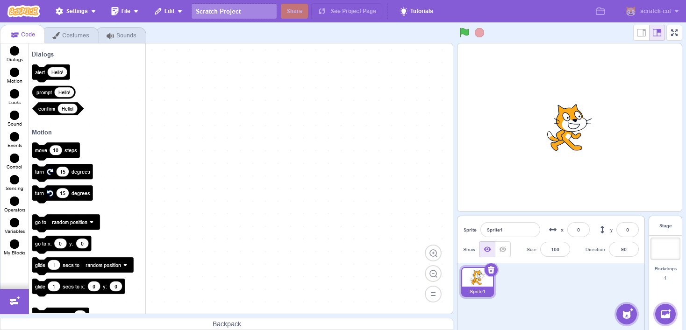

# Block Themes

## Enabling the hidden dark theme
First, let's enable the hidden dark theme.

In `scratch-gui`, go to `src/components/menu-bar/theme-menu.jsx`. In that file, there is a `ThemeMenu` component, which has a variable called `enabledThemes`, find it and add DARK_THEME.

```jsx title="scratch-gui/src/components/menu-bar/theme-menu.jsx"
const ThemeMenu = ({
    isRtl,
    menuOpen,
    onChangeTheme,
    onRequestOpen,
    theme
}) => {
    // highlight-next-line
    const enabledThemes = [DEFAULT_THEME, HIGH_CONTRAST_THEME, DARK_THEME];
    const themeInfo = themeMap[theme];
    
    // ...
}
```

Make sure you import it too:
```jsx title="scratch-gui/components/menu-bar/theme-menu.jsx"
import {DARK_THEME, DEFAULT_THEME, HIGH_CONTRAST_THEME, themeMap} from '../../lib/themes';
```

## Creating our own theme
Let's create a theme that makes Scratch harder by making all the colours the same (well two colours, foreground and background).

### Creating the theme
Copy and paste `src/lib/themes/default/index.js` to a new `src/lib/themes/hard-mode/index.js` and make some changes to it. I am going to make all the colours either black (foreground/text and blocks background) or white (background).

### Registering the theme
In `src/lib/themes/index.js`, add these:

```js title="scratch-gui/src/lib/themes/index.js"
// ...

import {blockColors as defaultColors} from './default';
// highlight-next-line
import {blockColors as hardModeBlockColors} from './hard-mode';

// ...

const DEFAULT_THEME = 'default';
const HIGH_CONTRAST_THEME = 'high-contrast';
const DARK_THEME = 'dark';
// highlight-next-line
const HARD_MODE_THEME = 'hard-mode';

// ...

const messages = defineMessages({
    // ...
    // highlight-start
    [HARD_MODE_THEME]: {
        id: 'gui.theme.hardModeTheme',
        defaultMessage: 'Hard Mode',
        description: 'label for hard mode'
    }
    // highlight-end
});

const themeMap = {
    // ...
    // highlight-start
    [HARD_MODE_THEME]: {
        blocksMediaFolder: 'blocks-media/default',
        colors: mergeWithDefaults(hardModeBlockColors),
        extensions: {},
        label: messages[HARD_MODE_THEME]
    }
    // highlight-end
};

// ...

export {
    DEFAULT_THEME,
    DARK_THEME,
    HIGH_CONTRAST_THEME,
    // highlight-next-line
    HARD_MODE_THEME,
    defaultColors,
    getColorsForTheme,
    themeMap
};
```

### Enabling the theme
This is the same process as the dark mode theme.

<details>
    <summary>Spoiler: The amazing hard mode Scratch editor:</summary>


</details>

## Completed Files
| Component         | File                                          | Download                                                      |
| ----------------- | --------------------------------------------- | ------------------------------------------------------------- |
| `scratch-gui`     | `src/lib/themes/index.js`                     | [index.js](resources/index.js.txt)                            |
| `scratch-gui`     | `src/components/menu-bar/theme-menu.jsx`      | [theme-menu.jsx](resources/theme-menu.jsx.txt)                |
| `scratch-gui`     | `src/lib/themes/hard-mode/index.js`           | [index-hardmode.js](resources/index-hardmode.js.txt)          |

---
<details>
    <summary>Scratch commit hashes at the time of this tutorial</summary>

    scratch-gui:        db1933b2aea9f9dbe51e0ad2d750a2550179314a
    scratch-vm:         d6420c4c9826d360adee118e0e9e255536be7f7c
    scratch-blocks:     686df65cc6b5b3df37dc3204f56f443aa18c5085
</details>