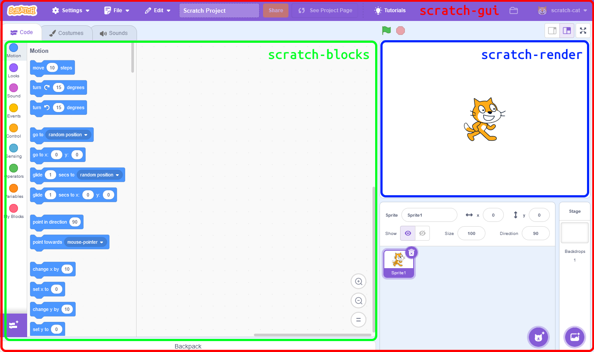

# Structure of Scratch

Unlike the previous versions of Scratch, Scratch 3.0 is separated into multiple packages, each of which is responsible for part of Scratch. For most mods, you probably do not need to modify (or even have a modifiable copy of) all the packages.

:::note
The Important badge is used to indicate components that are important _in modding_ Scratch. Most of the components provide important functionality that Scratch would not work without or have a degraded experience without.
:::

## `scratch-gui` Important
[`scratch-gui`](https://github.com/scratchfoundation/scratch-gui) is the _main_ package of Scratch. It brings together all the other packages and contains most of the user interface of Scratch.

## `scratch-vm` Important
[`scratch-vm`](https://github.com/scratchfoundation/scratch-vm) is responsible for executing the project code. This package contains the code that is executed when a block runs. It also contains the code for the built in extensions.

## `scratch-blocks` Important
[`scratch-blocks`](https://github.com/scratchfoundation/scratch-blocks) is the actual code editor part of the Scratch editor. It provides the block toolbox, workspace and the visuals of the blocks themselves. scratch-blocks is a fork of Google's [Blockly](https://developers.google.com/blockly/guides/overview) library.

## `scratch-render`
[`scratch-render`](https://github.com/scratchfoundation/scratch-render) contains the code responsible for rendering the project stage.

## `scratch-paint`
[`scratch-paint`](https://github.com/scratchfoundation/scratch-paint) is the Scratch paint editor.

## `scratch-audio`
[`scratch-audio`](https://github.com/scratchfoundation/scratch-audio) handles playing of audio in the project.

## `scratch-desktop`
[`scratch-desktop`](https://github.com/scratchfoundation/scratch-desktop) is the [Electron](https://electronjs.org)-based desktop application for Scratch.

## `scratch-render-fonts`
[`scratch-render-fonts`](https://github.com/scratchfoundation/scratch-render-fonts) contains the fonts available for use in Scratch.

## `scratch-storage`
[`scratch-storage`](https://github.com/scratchfoundation/scratch-storage) handles storage of Scratch projects.

## `scratch-svg-renderer`
[`scratch-svg-renderer`](https://github.com/scratchfoundation/scratch-svg-renderer) renders SVGs, while maintaining compatibility with Scratch 2.0's SVGs.

## `scratch-sb1-converter`
[`scratch-sb1-converter`](https://github.com/scratchfoundation/scratch-sb1-converter) converts old Scratch 1.4 (.sb) files into Scratch 2.0 (.sb2) files, which can then be converted to Scratch 3.0 (.sb3) files.